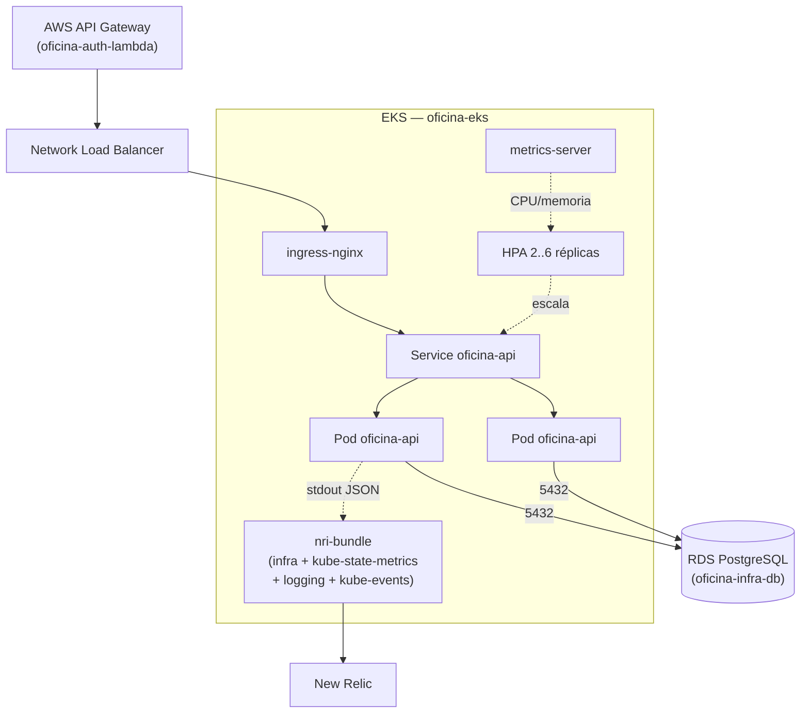

# oficina-infra-k8s

Infraestrutura como código do **cluster Kubernetes** da Oficina Mecânica
(Tech Challenge 13SOAT — Fase 3). Dois stacks Terraform no mesmo repositório:

| Stack | Diretório | Para quê |
|---|---|---|
| **Nuvem** | `terraform/` | Amazon EKS, ingress-nginx com NLB, metrics-server e o agente do New Relic |
| **Local** | `kind/` | Cluster kind com Postgres em StatefulSet — ciclo de desenvolvimento diário, custo zero |

Os dois entregam a mesma topologia de aplicação, então os manifestos em
`oficina-api/k8s/` (Deployment, Service, HPA, migrate-job) servem aos dois sem
alteração.

## Tecnologias

| Item | Escolha |
|---|---|
| IaC | Terraform >= 1.5, provider AWS ~> 5.0, kubernetes ~> 2.31, helm ~> 2.15 |
| Cluster | Amazon EKS 1.31, managed node group `t3.medium` (2 a 4 nodes) |
| Ingress | ingress-nginx 4.11.3, Service `LoadBalancer` do tipo NLB |
| Escalabilidade | metrics-server 3.12.2 + HPA (`oficina-api/k8s/hpa.yaml`) |
| Observabilidade | New Relic `nri-bundle` 5.0.100 |
| Local | kind (provider `tehcyx/kind`) |
| State | Backend S3 com lock em DynamoDB |

## Arquitetura



O agente não instrumenta a aplicação: ele **coleta o stdout dos pods**. Como a
`oficina-api` escreve uma linha JSON por requisição (`duration_ms`, `route`,
`status`, `correlation_id`), cada campo vira atributo consultável por NRQL. Foi
a saída encontrada porque o agente APM de PHP não suporta builds ZTS, que é o
que o FrankenPHP usa — registrado no ADR-003.

## Restrições do AWS Academy Learner Lab

O ambiente do curso impõe três limitações que moldaram este stack:

**Não é possível criar IAM roles.** O módulo do EKS criaria uma role para o
control plane e outra para os nodes; aqui os dois usam a `LabRole`
pré-existente (`create_iam_role = false` + `iam_role_arn`). Numa conta própria,
o correto seria deixar o módulo criar duas roles de mínimo privilégio.

**Não é possível criar chave KMS com política própria.** A criptografia de
secrets do cluster e o log group do control plane estão desligados
(`create_kms_key = false`, `cluster_enabled_log_types = []`), o que também evita
gastar orçamento com CloudWatch.

**O orçamento é de USD 50 e estourá-lo apaga o ambiente inteiro.** O Learner Lab
encerra as instâncias EC2 ao fim de cada sessão, mas **não** o Network Load
Balancer, que continua cobrando. Por isso existe o alvo `make teardown`, que
remove o ingress (e com ele o NLB) antes de destruir o cluster. Rode-o sempre
que terminar de usar.

## Execução local (kind)

```bash
cp kind/terraform.tfvars.example kind/terraform.tfvars   # git-ignored
# preencha app_key, db_password e, se quiser o agente, new_relic_license_key

make local-up
kubectl apply -k ../oficina-api/k8s/
kubectl -n oficina rollout status deployment/oficina-api
kubectl -n oficina port-forward svc/oficina-api 8080:80
```

Com a `new_relic_license_key` preenchida, os logs do kind já chegam ao New Relic
com o mesmo formato do EKS — dá para montar e validar os dashboards antes de o
cluster na nuvem existir:

```sql
SELECT * FROM Log WHERE service = 'oficina-api' SINCE 10 minutes ago
```

Para derrubar: `make local-down`.

## Deploy na nuvem (EKS)

Pré-requisito: `oficina-infra-db` já aplicado (este stack lê a VPC do state dele).

```bash
export BUCKET=oficina-tfstate-<sufixo>
export LOCK=oficina-tfstate-lock
export TF_VAR_new_relic_license_key=<license key de ingestão>

terraform -chdir=terraform init \
  -backend-config="bucket=$BUCKET" \
  -backend-config="region=us-east-1" \
  -backend-config="dynamodb_table=$LOCK"

terraform -chdir=terraform apply -var="tfstate_bucket=$BUCKET"
```

O `apply` leva ~15 minutos (o control plane do EKS domina). Depois:

```bash
make kubeconfig                 # registra o cluster no kubeconfig
kubectl get nodes
kubectl -n newrelic get pods    # nri-bundle Running
make nlb                        # URL do NLB -> backend_base_url em oficina-auth-lambda
```

E ao terminar a sessão:

```bash
make teardown
```

## CI/CD

| Workflow | Gatilho | O que faz |
|---|---|---|
| `ci.yml` | pull request | `fmt -check`, `init -backend=false` e `validate` nos dois stacks |
| `cd.yml` | push em `main` / `develop` | `apply` do stack de nuvem, espera o agente do New Relic subir e imprime a URL do ingress |

`main` = produção, `develop` = homologação. A branch `main` é protegida: sem
commit direto, PR obrigatório e o job de CI como status check exigido.

Secrets necessários: `AWS_ACCESS_KEY_ID`, `AWS_SECRET_ACCESS_KEY`,
`AWS_SESSION_TOKEN`, `TFSTATE_BUCKET`, `TFSTATE_LOCK_TABLE` e
`NEW_RELIC_LICENSE_KEY`. Os três primeiros expiram a cada sessão do Learner Lab
e precisam ser atualizados antes de cada deploy.

## Repositórios relacionados

| Repo | Papel |
|---|---|
| [`oficina-api`](../oficina-api) | Aplicação Laravel, manifestos `k8s/` e Dockerfile |
| [`oficina-auth-lambda`](../oficina-auth-lambda) | API Gateway + Lambdas de autenticação por CPF |
| [`oficina-infra-db`](../oficina-infra-db) | VPC, RDS PostgreSQL e Secrets Manager |
| `oficina-infra-k8s` | **este repositório** |
