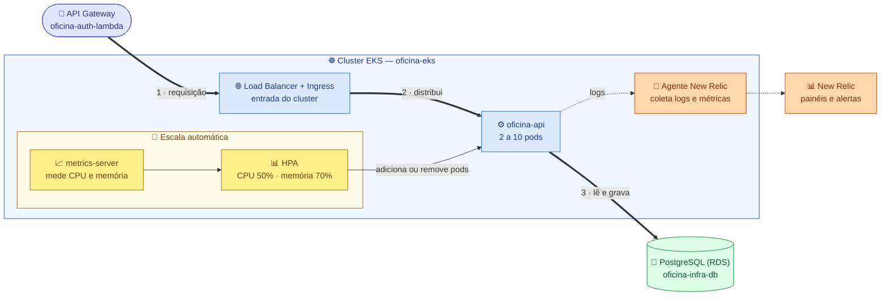

# oficina-infra-k8s

Terraform do **cluster Kubernetes** da Oficina Mecânica
(Tech Challenge 13SOAT — Fase 3).

## Links

| O quê | Link |
|---|---|
| 🚪 API em produção (API Gateway) | https://q7m1gn8vqi.execute-api.us-east-1.amazonaws.com |
| 🌐 Entrada do cluster (Load Balancer) | http://abd93cc27160b4d95b9d44139f6c8694-a7ed22eddfa6f5f5.elb.us-east-1.amazonaws.com |
| ⚙️ Código da API | [oficina_mecanica](https://github.com/Lorenalgm/oficina_mecanica) |
| 🔐 Autenticação | [oficina-auth-lambda](https://github.com/Lorenalgm/oficina-auth-lambda) |
| 🐘 Banco de dados | [oficina-infra-db](https://github.com/Lorenalgm/oficina-infra-db) |

> O endereço do Load Balancer muda cada vez que o cluster é recriado. O ambiente
> roda no AWS Academy Learner Lab e fica fora do ar entre as sessões.

## O que este repositório cria

Dois ambientes com a mesma estrutura, para que os manifestos da API
(`oficina_mecanica/k8s/`) funcionem nos dois sem mudança:

| Ambiente | Pasta | Para quê |
|---|---|---|
| ☁️ **Nuvem** | `terraform/` | Cluster EKS, Ingress com Load Balancer, metrics-server e agente do New Relic |
| 💻 **Local** | `kind/` | Cluster kind com Postgres, para desenvolver sem custo |

## Arquitetura

Leia o caminho da requisição pelos números **(1 → 3)**. O bloco amarelo ajusta
o número de pods conforme o uso.



**Legenda:** 🟪 entrada externa · 🟦 aplicação · 🟩 banco · 🟨 escala automática · 🟧 monitoramento

**Como o monitoramento funciona:** o agente lê o que a API escreve no log. Cada
requisição gera uma linha JSON com rota, status, tempo de resposta e um id de
rastreio, e o New Relic transforma esses campos em painéis. Foi a solução
adotada porque o agente PHP do New Relic não funciona com o FrankenPHP
([ADR-003](https://github.com/Lorenalgm/oficina_mecanica/blob/main/docs/adrs/ADR-003-observabilidade-via-logs-estruturados.md)).

## Stack

| Item | Escolha |
|---|---|
| Infraestrutura como código | Terraform ≥ 1.5 |
| Cluster | Amazon EKS 1.31, 2 a 4 nodes `t3.medium` |
| Entrada | ingress-nginx com Network Load Balancer |
| Escala | metrics-server + HPA |
| Monitoramento | New Relic (`nri-bundle`) |
| Local | kind |
| Estado do Terraform | S3 com trava no DynamoDB |

## Limitações do AWS Academy

| Limitação | Solução adotada |
|---|---|
| Não é possível criar permissões (IAM roles) | Cluster e nodes usam a role pronta `LabRole` |
| O módulo pronto do EKS falha por falta de permissão | Cluster declarado direto com recursos do Terraform ([ADR-004](https://github.com/Lorenalgm/oficina_mecanica/blob/main/docs/adrs/ADR-004-labrole-no-aws-academy.md)) |
| Não é possível criar chave de criptografia própria | Logs do control plane desligados (também economiza orçamento) |
| Orçamento de USD 50, e o Load Balancer continua cobrando entre sessões | `make teardown` remove o Load Balancer e o cluster ao fim do uso |

## Rodar localmente (kind)

```bash
cp kind/terraform.tfvars.example kind/terraform.tfvars   # preencha app_key e db_password
make local-up

kubectl apply -k ../oficina_mecanica/k8s/
kubectl -n oficina rollout status deployment/oficina-api
kubectl -n oficina port-forward svc/oficina-api 8081:80
```

Para apagar: `make local-down`.

## Deploy na nuvem (EKS)

Pré-requisito: [oficina-infra-db](https://github.com/Lorenalgm/oficina-infra-db)
já aplicado (a rede vem de lá).

```bash
export TF_VAR_new_relic_license_key=<chave do New Relic>

terraform -chdir=terraform init \
  -backend-config="bucket=<bucket do state>" \
  -backend-config="region=us-east-1" \
  -backend-config="dynamodb_table=<tabela de trava>"

terraform -chdir=terraform apply -var="tfstate_bucket=<bucket do state>"
```

Leva cerca de 15 minutos. Depois:

```bash
make kubeconfig    # conecta o kubectl ao cluster
kubectl get nodes
make nlb           # mostra o endereço do Load Balancer
```

Esse endereço vai na variável `BACKEND_BASE_URL` do repositório
[oficina-auth-lambda](https://github.com/Lorenalgm/oficina-auth-lambda).

Ao terminar a sessão: `make teardown`.

## CI/CD

| Workflow | Quando roda | O que faz |
|---|---|---|
| `ci.yml` | pull request | Valida o Terraform dos dois ambientes |
| `cd.yml` | push em `main` ou `develop` | Aplica o Terraform na AWS e mostra o endereço do Load Balancer |

- `main` = produção, `develop` = homologação. A `main` só recebe código por pull request.
- Secrets: `AWS_ACCESS_KEY_ID`, `AWS_SECRET_ACCESS_KEY`, `AWS_SESSION_TOKEN`,
  `TFSTATE_BUCKET`, `TFSTATE_LOCK_TABLE`, `NEW_RELIC_LICENSE_KEY`.
- As credenciais da AWS expiram a cada sessão do Learner Lab e precisam ser
  atualizadas antes do deploy.
